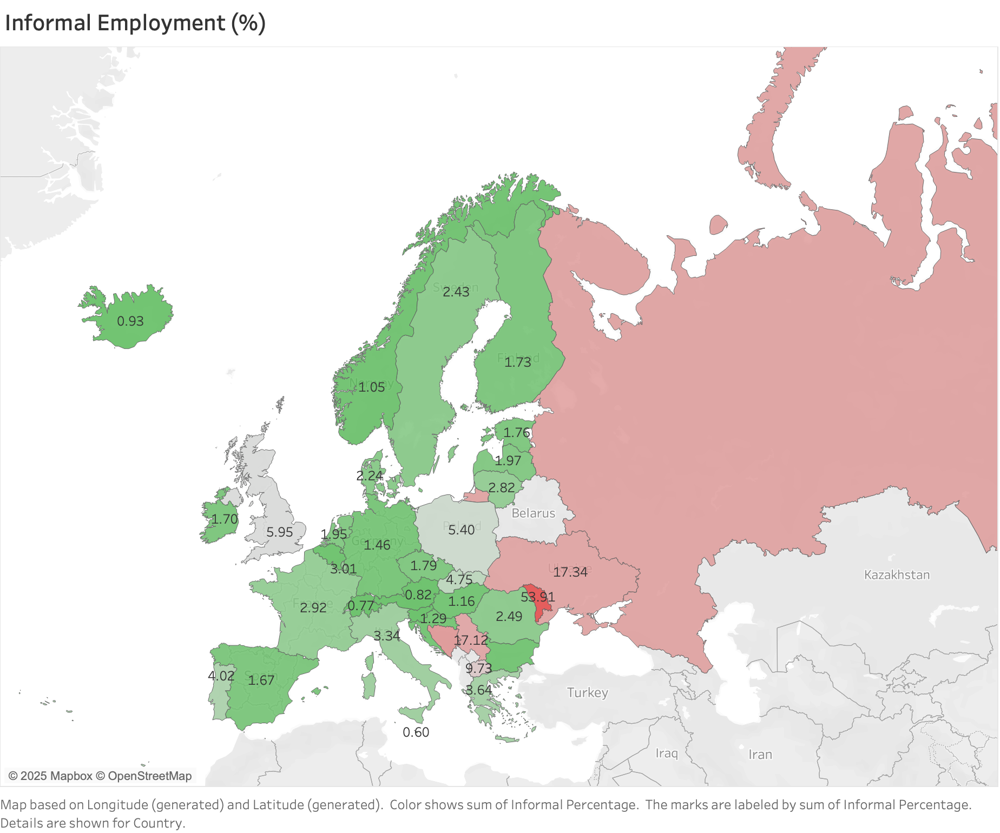
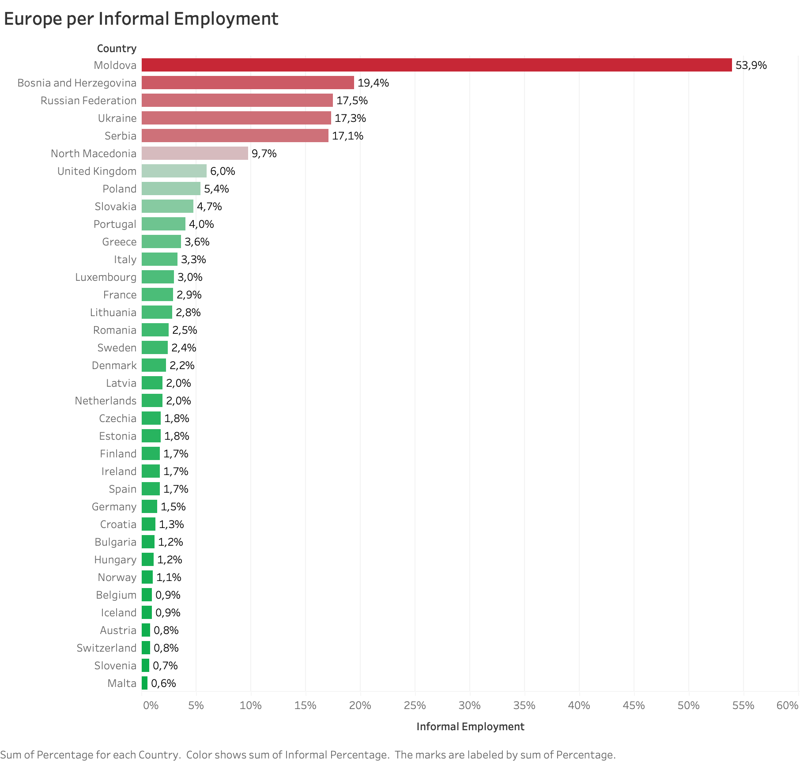
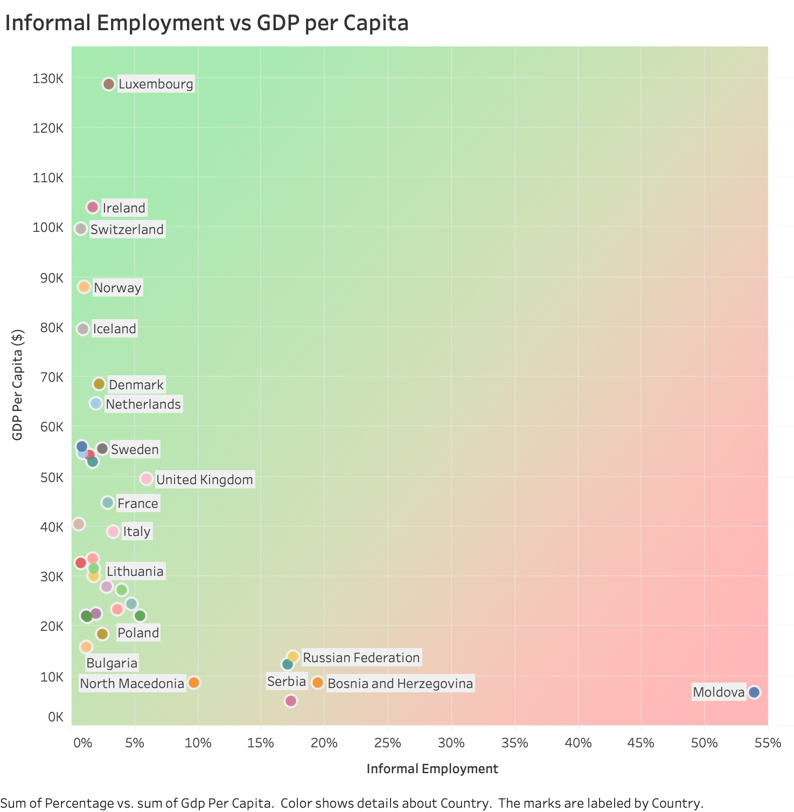

# Informal Employment in Europe

## Project Overview

This project explores informal employment rates across European countries and analyzes their relationship with GDP per capita. The goal is to identify regional disparities and economic patterns using publicly available data. The project combines data cleaning, SQL-based preprocessing, and data visualization using Tableau.

## Data Sources

The analysis is based on the following datasets:

1. **Labour Force Data** – World Bank: Total labor force statistics by country
   [Link](https://data.worldbank.org/indicator/SL.TLF.TOTL.IN)

2. **Informal Employment** – International Labour Organization (ILO): Most recent records on informal employment rates
   [Link](https://ilostat.ilo.org/topics/informality/)

   For Ukraine: [Ukrstat](https://www.ukrstat.gov.ua/operativ/operativ2017/rp/eans/eans_e/Arch_nzn_ved_e.htm)

3. **GDP per Capita** – World Bank: GDP per capita in current US dollars (2024)
   [Link](https://data.worldbank.org/indicator/NY.GDP.PCAP.CD?end=2024&locations=Z7&start=2024&view=bar)

## Key Metrics

* **Informal Employment (%):** Share of the employed population working in the informal sector. This includes jobs not covered by national labor legislation, without contracts or social protections.
* **GDP per Capita (\$):** GDP per capita is gross domestic product divided by midyear population. GDP is the sum of gross value added by all resident producers in the economy plus any product taxes and minus any subsidies not included in the value of the products. Data are in current U.S. dollars.

## Visualizations and Interpretation

### 1. Geographic Distribution of Informal Employment

This map provides a regional overview of informal employment across Europe. Color gradients indicate employment informality. Eastern and Southeastern Europe have the highest concentrations, highlighting significant regional disparities.

### 2. Informal Employment by Country

This bar chart shows the percentage of informal employment by country. Moldova leads with 53.9%, followed by Bosnia and Herzegovina, Russia, Ukraine, and Serbia. Western and Northern European countries display significantly lower rates.

### 3. Informal Employment vs. GDP per Capita

A scatter plot displaying the relationship between informal employment rates and GDP per capita. A negative correlation is visible — higher informal employment typically corresponds to lower GDP per capita. Moldova and Serbia have high informal employment and low GDP, while Switzerland and Luxembourg are on the opposite end.

## How to Use This Repository

* The `data/` folder contains all cleaned datasets used in the analysis (CSV and Excel formats).
* SQL queries for preprocessing can be found in the `sql/` folder.
* Tableau visualizations are available in the `tableau/` folder (`.twb` format).
* Key dashboards are available in the `visualizations/` folder.

You can open the Tableau workbook (`Informal_Employment_Europe.twb`) using Tableau Desktop to explore the dashboards interactively.

## Technologies used

- Excel (data preparation)
- SQL (data cleaning and queries)
- Tableau (data visualization)

## Key Insights

* Informal employment is more prevalent in Eastern and Southeastern Europe.
* There is a strong inverse relationship between informal employment and GDP per capita.
* Countries with high informality tend to face greater economic challenges and lower average incomes.

## License

This project uses open data from the World Bank, ILO, and national statistics.

---

